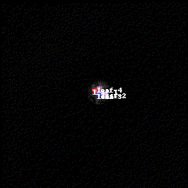

# Leaf Tracking for plant top-down images
 A leaf tracking repository for top-down images on arabidopsis. This repository has been created as part of the research paper: DOI XXXX/XXXXXXXX
 

### Usage
Clone the repository with:
```powershell
git clone https://github.com/Fedjurrui/Leaf-Tracking.git
```
Move inside the folder:
```powershell
cd Leaf-Tracking
```
Then install the requirements:
```powershell
pip install -r requirements.txt
```

Open using [Visual Studio Code](https://code.visualstudio.com/) the folder and the open the Example_run.ipynb notebook file. Be mindful that it is a jupyter notebook, so if you have not worked with notebooks you might find the [documentation on jupyter notebook in VSCode](https://code.visualstudio.com/docs/datascience/jupyter-notebooks) usefull.

### Recomendations
It is highly encouraged to use a workstation or cluster with a GPU. Inference times are greatly improved doing so eventhough it is not strictly required and the code has been prepared to run on CPU.

### Acknowledgments
<p>This work has been developed during a colaboration between the plant genetics research departament at the Wageningen University and Research (WUR) and the Center for Research in Agricultural Genomics (CRAG). The development of this work has been possible thanks to the following contributors:</p>

[<b>Federico Jurado Ruiz</b>](https://www.cragenomica.es/staff/federico-jurado). <i>PhD Candidate</i>. Center for Research in Agricultural Genomics (CRAG). Main developer and maintainer of the repository.<br>
[<b>Dr. Phuong Nguyen</b>](https://www.wur.nl/es/persons/phuong-dr.-tp-phuong-nguyen.htm). <i>Post-doctoral Researcher</i>. Wageningen University and Research (WUR). Plant dataset owner and provider. Main biological advisor.<br>
[<b>Dr. Joseph Peller</b>](https://www.wur.nl/es/Persons/Joseph-dr.-JA-Joseph-Peller.htm). <i>Researcher</i>. Wageningen University and Research (WUR). Main AI and methodology advisor.<br>
[<b>Dr. Maria Jose Aranzana Civit</b>](https://www.cragenomica.es/staff/maria-jose-aranzana). <i>Researcher</i>. Institute of Agrifood Research and Technology (IRTA) and Center for Research in Agricultural Genomics (CRAG). Supervisor.<br>
[<b>Dr. Ing. Gerrit Polder</b>](https://www.wur.nl/en/Persons/Gerrit-dr.ing.-G-Gerrit-Polder.htm). <i>Researcher</i>. Wageningen University and Research (WUR). Supervisor.<br>
[<b>Prof. Dr. Mark Aarts</b>](https://www.wur.nl/es/persons/mark-prof.dr.-mgm-mark-aarts.htm). <i>Researcher</i>. Wageningen University and Research (WUR). Main project supervisor.

